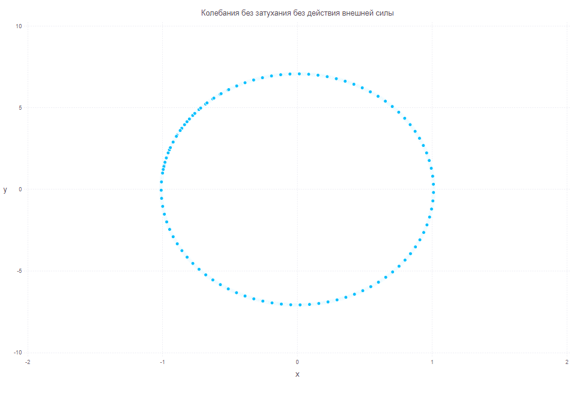
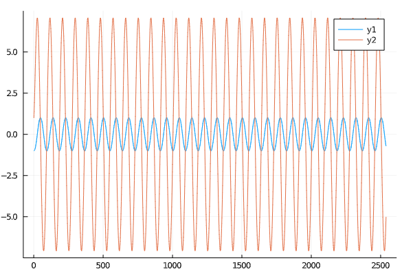
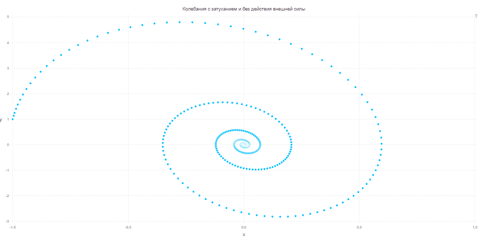
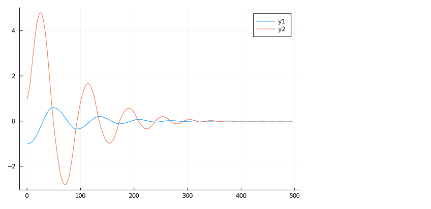
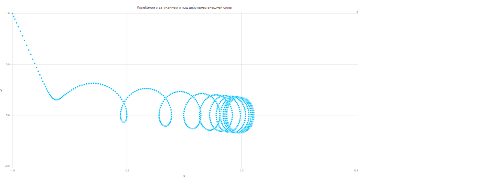
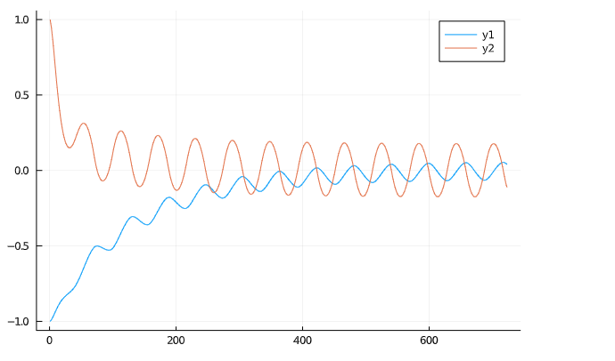

---
## Front matter
lang: ru-RU
title: Модель гармонических коллебаний
author: | Швец С.
institute: |
	\inst{1}RUDN University, Moscow, Russian Federation
date: 2021, 06 Marср
## Formatting
toc: false
slide_level: 2
theme: metropolis
header-includes:
 - \metroset{progressbar=frametitle,sectionpage=progressbar,numbering=fraction}
 - '\makeatletter'
 - '\beamer@ignorenonframefalse'
 - '\makeatother'
aspectratio: 43
section-titles: trueы
---
# Цель работы

Изучить и построить модель линейного гармонического осциллятора


# Выполнение лабораторной работы

## Здача
Построить фазовый портрет гармонического осциллятора и решение уравнения гармонического осциллятора для следующих случаев:

1. Колебания гармонического осциллятора без затуханий и без действий внешней силы: $\ddot{x}+7x = 0$

2. Колебания гармонического осциллятора c затуханием и без действий внешней силы: $\ddot{x}+2\dot{x}+6x = 0$

3. Колебания гармонического осциллятора c затуханием и под действием внешней силы: $\ddot{x}+5\dot{x}+1x = cos(3t)$

На интервале $t \in[0;25]$(шаг 0.05) с начальными условиями $x_0 = -1, y_0 = -1$


## 1. Колебания гармонического осциллятора без затуханий и без действий внешней силы

Уравнение:

$\ddot{x}+7x = 0$

Начальные данные:
- $x_0$ = -1
- $y_0$ = -1


## Решение
Функция осциляции
```
function portret(w, g, x0, y0)

    function SDU(du,u,p,t)
        du[1] = u[2]
        du[2] = -w*w*u[1]-g*u[2]-f(t)
    end
    u0 = [x0, y0]
    tspan = (0.0, 25)
    prob = ODEProblem(SDU, u0, tspan)
    sol = solve(prob, RK4(),reltol=1e-6, timeseries_steps = 0.05)
    N = length(sol.u)
    J = length(sol.u[1])
    U = zeros(N, J)
    for i in 1:N, j in 1:J
        U[i,j] = sol.u[i][j]
    end
    U
end


```

## Решение
```
f(t) = 0
ans1 = portret(7, 0,1, 1);

Plots.plot(ans1)

set_default_plot_size(30cm, 20cm)
 Gadfly.plot(x = ans1[:,1], y = ans1[:,2],
        Guide.title("Колебания без затухания без действия внешней силы"

```

## Решение

Зададим СДУ, определяем проблему и решаем систему:
```
function syst(du,u,p,t)
    du[1] = u[2]
    du[2] = -ω*ω*u[1]-γ*u[2]-f(t)
end

    u0 = [x0, y0]
    tspan = (0.0, 67)

    prob = ODEProblem(syst, u0, tspan)
    sol = solve(prob, RK4(),reltol=1e-6, timeseries_steps = 0.05)
```


## Решение
Грфик

```
f(t) = 0
ans1 = portret(7, 0,1, 1);

Plots.plot(ans1)

set_default_plot_size(30cm, 20cm)
 Gadfly.plot(x = ans1[:,1], y = ans1[:,2],
        Guide.title("Колебания без затухания без действия внешней силы"))
```

## Решение


## Решение

Построение решения:

## Решение: График №1

Колебания гармонического осциллятора без затуханий и без действий внешней силы(рис. -@fig:001)

{ #fig:001 width=70% }


## Решение: График №2
Решение уравнения гармонического осциллятора без затуханий и без действий внешней силы(рис. -@fig:002)

{ #fig:002 width=70% }


## 2. Колебания гармонического осциллятора с  затуханием и без действий внешней силы

Зададим начальные значения и параметры:

```
set_default_plot_size(30cm, 20cm)
 Gadfly.plot(x = ans1[:,1], y = ans1[:,2],
        Guide.title("Колебания без затухания без действия внешней силы"))
Plots.plot(ans2)

```

## Решение: График №3

Колебания гармонического осциллятора c затуханием и без действий внешней силы(рис. -@fig:003)

{ #fig:003 width=70% }

## Решение: График №4

Решение уравнения для модели гармонического осциллятора с затуханиями и без действий внешней силы(рис. -@fig:004)

{ #fig:004 width=70% }

## 3. Колебания гармонического осциллятора c затуханием и под действием внешней силы


```
f(t) = cos(3t)
ans3 = portret(1, 5, -1, 1)
set_default_plot_size(40cm, 20cm)
 Gadfly.plot(x = ans3[:,1], y = ans3[:,2],
        Guide.title("Колебания c затуханием и под действием внешней силы"))

  Plots.plot(ans3)

```

## Решение: График №5

Колебания гармонического осциллятора c затуханием и действием внешней силы(рис. -@fig:005)

{ #fig:005 width=70% }

## Решение: График №6

Решение уравнения для модели гармонического осциллятора с затуханиями и с воздействием внешней силы(рис. -@fig:006)

{ #fig:006 width=70% }


# Выводы

Мы изучили модель линейного гармонического коллебания и построили ее фазовую траекторю и график решения
